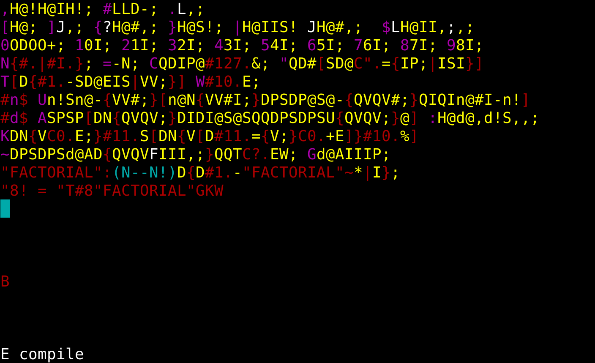

# colorfool

This is a simple programming language based on Chuck Moore's colorForth as
well as my own FOOL (Forth On One Line) language. We start with a screenshot
of the editor, viewing a 64x32 block of source code.

## Native words

B | BYE     | --        | terminate
D | DUP     | x -- x x  | duplicate TOS
E | EMIT    | c --      | print low 7 bits of word
H | HERE    | -- a      | variable containing end of heap pointer
I | 1+      | n -- n+1  | increment by 1 
J | BRANCH  | --        | word at IP+1 -> IP
F |         | --        | like BRANCH but push IP+1 first, high-level call
L | LIT     | -- x      | push word at IP+1
O | 2*      | n -- n*2  | double
P | >R      | x --      | push to return stack
Q | R>      | -- x      | pop from return stack
R | KEY     | -- c      | read one character
S | SWAP    | x y -- y x | swap TOS and NOS
V | DROP    | x --      | drop TOS
; | EXIT    | --        | exit from subroutine
@ | @       | a -- x    | load TOS from address in TOS
! | !       | x a --    | store NOS to address in TOS
+ | +       | n m -- n+m | add TOS to NOS
* | *       | n m -- n\*m | multiply TOS to NOS
- | -       | n m -- n-m | subtract TOS from NOS
& | &       | n m -- n&m | bitwise and TOS to NOS
% | /MOD    | n m -- n%m n/m | division with remainder
? | ?BRANCH | b --      | word at IP+1 -> IP if TOS is zero

## Kernel definitions

, | ,       | x --      | append value to heap
# |         | -- 0      | push the constant 0
. |         | x --      | compile LIT x
[ | IF      | -- a      |
\| | ELSE   | a -- a    |
] | THEN    | a --      |
U |         | a1 n1 a2 n2 -- b | string equality
K | .       | n --      | output decimal integer
A |         | a1 n a2 -- a3 | lookup string (a1 n) in dictionary (a2)
W | CR      | --        | print a newline
T | TYPE    | a n --    | print a string
C | [CHAR]  | -- c      | push the following (red) character
" | S"      | -- a n    | literal string (note: not compiling anything)
$ | VARIABLE | --       | use like (red)#(magenta)n(red)$
